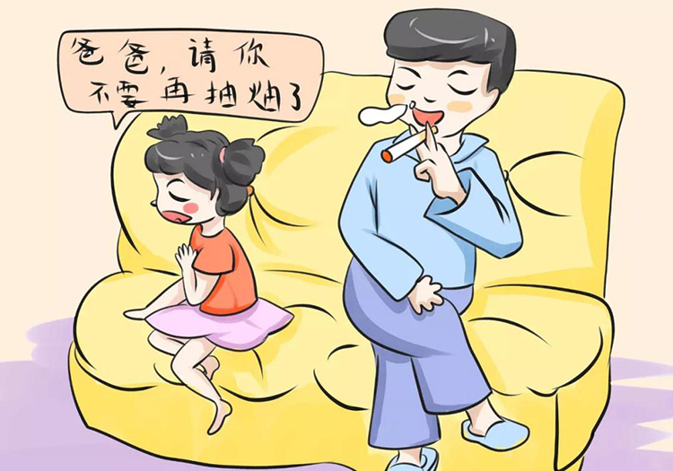
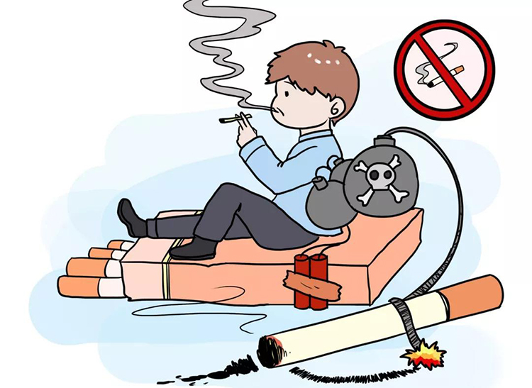
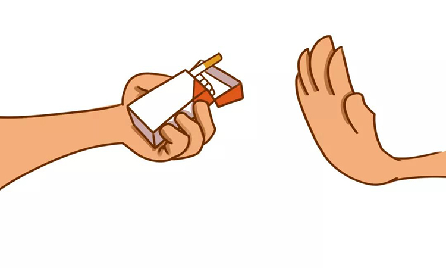

春节是中国最重要的传统节日，朋友相聚、亲人团聚，往往少不了吸烟或送烟。公众对烟草的危害认识不够，常将其作为沟通感情、馈赠亲朋的礼物。
　　殊不知，烟草烟雾中含有数百种有害物质，几乎对人体的各个脏器都会造成损害。全世界前8位死因中，有6种与吸烟有关。我国每年有100多万人死于吸烟和二手烟暴露导致的相关疾病。吸烟带来的健康和经济损失巨大，已经成为最严重的公共卫生问题之一。

 

电子烟不是戒烟手段

　　最近两年市面上存在着各种各样的电子烟，电子烟不但会产生许多已知的有害物质，还会产生一些特有的新的有害物质，同时电子烟还存在爆炸风险等严重的安全隐患。所以电子烟依然有害公共健康，它更不是戒烟手段，必须对其加强管制，杜绝对青少年和非吸烟者产生危害。

二手烟有害健康

 

　　对于不吸烟的人群，特别是儿童、老人、妇女（孕妇）等，如果暴露于二手烟中，即使吸入少量的烟草烟雾也会对人体产生危害。

抽烟不能预防肺炎

 

 
　　网络上还有一些谣传说抽烟可以预防肺炎，这也是错误的。预防通过呼吸道进入人体的传染病，一个有效的手段就是戴口罩。吸烟绝对不是一个抵御病毒的办法。恰恰相反，吸烟会给病毒带来更多的感染机会。

过健康无烟春节

 

　　由于传统观念的影响，我国仍存在把烟草作为礼物赠送给他人的风气，但实际上却在送去祝福的同时也给亲朋好友送去了危害。国家卫生健康委倡导“主动远离烟草危害，做自己健康的责任人”，春节期间大家不吸烟、不送烟，过一个健康、文明的无烟春节。
 

　　（来源：综合国家卫生健康委、中国健康教育中心）