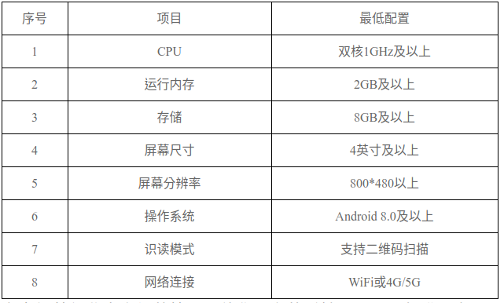

国烟办综〔2022〕162号

 

各省级烟草专卖局：

为贯彻落实《电子烟管理办法》（国家烟草专卖局公告2022年第1号）等相关文件要求，进一步完善电子烟产品追溯体系，以加强电子烟产品全流程管理，现将有关事项通知如下：

一、二维码追溯系统部署

境内销售电子烟产品的盒、箱包装单元应标注由国家烟草专卖局统一发布的二维码标签。国家烟草专卖局将部署电子烟二维码追溯系统，并向持证电子烟生产企业、批发企业提供电子烟二维码追溯系统PDA端应用程序安装包及系统登录账号。

二、二维码标注要求

（一）二维码技术标准。

电子烟产品二维码采用快速响应矩阵码（QR码）码制，字母数字型字符集，按照版本3、纠错等级M（15%）的标准生成。

（二）外观及标注要求。

二维码为白底黑色图案，不得使用圆形、液化等特殊外观效果，不得附加其他图案。二维码精度不低于600DPI，可印制到包装上或制成标签粘贴到包装上。二维码应直接附着于包装纸面，不得附着于塑封外。二维码所在面不得存在其他二维码或条形码。二维码应具有一定的耐久性，在正常使用条件下保持清晰可读。

（三）尺寸及位置要求。

标注在箱包装的二维码图案边长为36mm，位于包装箱外侧背面（即与主要可见面相对的面，下同）的右上角（以商标文字或图案的正向可视方向为参考视角，下同），二维码图案边缘与包装箱侧边及顶边的距离为20mm～40mm。

标注在盒包装的二维码图案边长为12mm，位于包装盒外侧背面的右上角，二维码图案边缘与包装盒侧边及顶边的距离为5mm～10mm。

三、手持PDA配置要求

电子烟生产企业、批发企业可根据自身生产经营和既有设备情况，自主购置手持PDA。手持PDA需满足下表所列最低配置标准。

电子烟批发企业也可参考烟草行业生产经营管理一体化平台的手持PDA配置标准配备。

请行业各单位督促辖区内持证电子烟生产企业、批发企业，尽快落实上述要求，并做好内销电子烟产品二维码追溯系统部署实施的相关工作。

 

                                                                         国家烟草专卖局办公室      

                                   2022年9月30日 